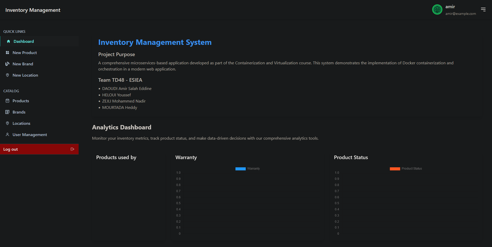

# Inventory Management System (IMS) - Microservices with Docker

A comprehensive Inventory Management System built using a microservices architecture, containerized with Docker. This project demonstrates the implementation of a modern web application using containerization and orchestration technologies.

## Team Information

**Class**: TD48 - ESIEA

**Team Members**:
- DAOUDI Amir Salah Eddine
- HELOUI Youssef
- ZEJLI Mohamed-Nadir
- MOURTADA Heddy

## Project Overview

This project is developed as part of the Containerization and Virtualization course, focusing on creating a microservices-based application using Docker. The system consists of three main components:

- **Frontend Service**: Built with Vite and React.js
- **Backend Service**: Developed using Node.js and Express.js
- **Database Service**: MongoDB for data persistence

### Architecture Overview

```plaintext
┌─────────────────┐     ┌─────────────────┐     ┌─────────────────┐
│    Frontend     │     │     Backend     │     │    Database     │
│  (Vite/React)   │────▶│  (Node/Express) │────▶│    (MongoDB)    │
└─────────────────┘     └─────────────────┘     └─────────────────┘
```

## Features

- User authentication and authorization
- Product management (CRUD operations)
- Company and location tracking
- Brand management
- Product history tracking
- Analytics dashboard
- Responsive design with Tailwind CSS

## Technical Stack

- **Frontend**:
  - Vite
  - React.js
  - Tailwind CSS
  - Redux for state management

- **Backend**:
  - Node.js
  - Express.js
  - JWT for authentication
  - MongoDB drivers

- **Database**:
  - MongoDB

- **DevOps**:
  - Docker
  - Docker Compose
  - Multi-stage builds

## Docker Setup

The application is fully containerized using Docker, with each service running in its own container:

### Services Architecture

1. **MongoDB Service**:
   - Uses official MongoDB 6.0 image
   - Persistent volume for data storage
   - Health checks for reliability

2. **Backend Service**:
   - Multi-stage build for optimization
   - Node.js 18.8.0 base image
   - Environment variables for configuration
   - Waits for MongoDB availability

3. **Frontend Service**:
   - Node.js 18 with Alpine for minimal size
   - Vite development server
   - Environment variables for API configuration

### Docker Compose Configuration

Our `docker-compose.yml` orchestrates all services:

```yaml
services:
  mongo:
    image: mongo:6.0
    volumes: 
      - mongo_data:/data/db
    healthcheck:
      test: ["CMD", "mongosh", "--eval", "db.adminCommand('ping')"]

  backend:
    build: ./Backend
    depends_on:
      mongo:
        condition: service_healthy

  frontend:
    build: ./Frontend
    depends_on:
      - backend
```

### Building and Running

```bash
# Build and start all services
docker-compose up --build

# View service logs
docker-compose logs [service_name]

# Stop all services
docker-compose down

# Remove volumes (if needed)
docker-compose down -v
```

## Environment Variables

### Backend (.env)
```env
MONGODB_URI=mongodb://mongo:27017/inventory
PORT=3000
SECRET_KEY=your-secret-key
```

### Frontend (.env)
```env
VITE_SERVER=http://localhost:3000
```

## API Endpoints

### Authentication
- POST `/api/v1/auth/register` - Register new user
- POST `/api/v1/auth/login` - User login

### Products
- GET `/api/v1/products` - List all products
- POST `/api/v1/products` - Add new product
- PUT `/api/v1/products/:id` - Update product
- DELETE `/api/v1/products/:id` - Delete product

### Analytics
- GET `/api/v1/analytics` - Get analytics data

## Application Screenshots

### 1. Dashboard Home

The main dashboard provides a comprehensive overview of your inventory system, featuring:
- Real-time analytics and metrics
- Product status distribution
- Warranty expiration tracking
- Team information and project details

### 2. Brand Management

Efficiently manage product brands with features including:
- Add new brands/manufacturers
- Track brand-specific products
- Manage brand relationships
- Update brand information

### 3. Location Management

Keep track of your inventory across different locations:
- Add new storage locations
- Monitor stock levels by location
- Manage location capacity
- Track product movements

### 4. Product Management

Comprehensive product management interface offering:
- Add new products with detailed information
- Track product specifications
- Monitor stock levels
- Manage product warranties
- Update product information

### 5. User Management

Secure user management system featuring:
- User role management
- Access control
- User activity tracking
- Account management

## Development

### Prerequisites
- Docker Desktop
- Node.js 18.x (for local development)
- Git

### Local Development
1. Clone the repository
2. Install dependencies for each service
3. Set up environment variables
4. Run `docker-compose up --build`

## Troubleshooting

Common issues and solutions:

1. **Frontend Connection Issues**:
   - Ensure Vite is configured to listen on all interfaces
   - Check CORS configuration in backend

2. **Database Connection**:
   - Verify MongoDB container is healthy
   - Check connection string format

3. **Container Startup**:
   - Use `docker-compose logs` to debug
   - Ensure all ports are available

## Project Structure

```plaintext
IMS-DOCKER/
├── Backend/
│   ├── controllers/
│   │   ├── product_controller.js    # Product-related operations
│   │   └── user_controllers.js      # User authentication and management
│   ├── db/
│   │   └── user_db.js              # Database connection configuration
│   ├── middlewares/
│   │   └── user_auth.js            # Authentication middleware
│   ├── models/
│   │   ├── company_model.js        # Company data schema
│   │   ├── history_model.js        # Product history schema
│   │   ├── locations_models.js     # Location data schema
│   │   ├── product_model.js        # Product data schema
│   │   └── user_model.js           # User data schema
│   ├── routes/
│   │   ├── analyticsRoutes.js      # Analytics API endpoints
│   │   ├── companyRoutes.js        # Company management endpoints
│   │   ├── historyRoutes.js        # Product history endpoints
│   │   ├── locationRoutes.js       # Location management endpoints
│   │   ├── productRoutes.js        # Product management endpoints
│   │   └── user_routes.js          # User authentication routes
│   ├── utils/
│   │   └── user_utils.js           # Utility functions
│   ├── .env                        # Backend environment variables
│   ├── app.js                      # Main application entry
│   ├── Dockerfile                  # Backend container configuration
│   ├── package.json               
│   └── seed.js                     # Database seeding script
│
├── Frontend/
│   ├── src/
│   │   ├── assets/                 # Static assets
│   │   │   ├── admin-logo.svg
│   │   │   ├── authenticate.svg
│   │   │   ├── menu.svg
│   │   │   ├── react.svg
│   │   │   └── user-logo.svg
│   │   ├── components/             # Reusable UI components
│   │   │   ├── HeaderBar.jsx
│   │   │   ├── LoadingIndicator.jsx
│   │   │   ├── LogoutButton.jsx
│   │   │   ├── PopUpComponent.jsx
│   │   │   ├── ShowErrorMessage.jsx
│   │   │   ├── ShowSuccessMessage.jsx
│   │   │   └── SideNavbar.jsx
│   │   ├── screens/               # Application views
│   │   │   ├── brands/           # Brand management screens
│   │   │   ├── dashboard/        # Analytics dashboard
│   │   │   ├── locations/        # Location management
│   │   │   ├── login/           # Authentication screens
│   │   │   ├── product/         # Product management
│   │   │   └── users/           # User management
│   │   ├── App.jsx              # Root component
│   │   ├── main.jsx             # Application entry point
│   │   └── router.jsx           # Route definitions
│   ├── .env                     # Frontend environment variables
│   ├── Dockerfile              # Frontend container configuration
│   ├── index.html             # HTML entry point
│   ├── package.json
│   ├── tailwind.config.js     # Tailwind CSS configuration
│   └── vite.config.js         # Vite build configuration
│
├── docker-compose.yml         # Multi-container orchestration
└── README.md                 # Project documentation
```

### Key Directories

1. **Backend/**
   - `controllers/`: Business logic for different features
   - `models/`: MongoDB schema definitions
   - `routes/`: API endpoint definitions
   - `middlewares/`: Request processing middleware
   - `utils/`: Helper functions and utilities

2. **Frontend/**
   - `src/components/`: Reusable React components
   - `src/screens/`: Main application views
   - `src/assets/`: Static files (images, icons)
   - `src/router.jsx`: Application routing logic

3. **Root Directory**
   - `docker-compose.yml`: Defines and configures all services
   - `README.md`: Project documentation and setup instructions

### Configuration Files

1. **Backend Configuration**
   - `.env`: Environment variables
   - `package.json`: Dependencies and scripts
   - `Dockerfile`: Container build instructions

2. **Frontend Configuration**
   - `.env`: Environment variables
   - `vite.config.js`: Build configuration
   - `tailwind.config.js`: CSS framework settings
   - `Dockerfile`: Container build instructions
